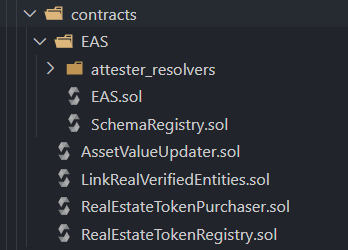

# LinkReal AppScaffold

<i>Built with [Scaffold-Eth](https://scaffoldeth.io)</i> 🔥

<h4 align="center">
  <a href="https://scaffoldeth.io">Website</a> | 
  <a href="https://docs.scaffoldeth.io">Demo Video</a>
</h4>

⭐ This repo contains both the frontend and smart contracts for the LinkReal platform. 

## Setup 

As in the Scaffold-Eth repo.

## Smart Contracts

1. **RealEstateToknRegistry.sol** - This contract is the main contract that manages the creation of new RealEstateTokens ( ERC 1155 ).

2. **LinkRealVerifiedEntities.sol** - 