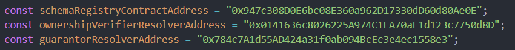

# LinkReal AppScaffold

<i>Built with [Scaffold-Eth](https://scaffoldeth.io)</i> 🔥

<h4 align="center">
  <a href="https://scaffoldeth.io">Website</a> | 
  <a href="https://docs.scaffoldeth.io">Demo Video</a>
</h4>

⭐ This repo contains both the frontend and smart contracts for the LinkReal platform.

## Setup

1. Install packages as in the Scaffold-Eth docs.
2. Setup .env file according to the .env.example file. (Add API Keys for Arbitrum Sepolia. Arb Sepolia is configured as the source chain inside deploy script )
3. Run `yarn deploy` This will deploy the contracts, verify the contracts and run the `02_post_deploy_procedures` script to setup the contracts.
3. In `createEASSchemas.ts` script inside hardhat scripts dir, update the below contract addresses with the newly deployed addresses.
 
4. Run the `createEASSchemas.ts`( specify the network as arbitrumSepolia )
5. Replace the schema uid values inside `/packages/nextjs/settings/config.ts` with the values logged to the console from above createEASSchemas.ts script.

5. Update the consumer addresses in the chainlink functions subscription.

## Smart Contracts

1. **RealEstateToknRegistry.sol** - This contract is the main contract that manages the creation of new RealEstateTokens ( ERC 1155 ).

2. **LinkRealVerifiedEntities.sol** -
